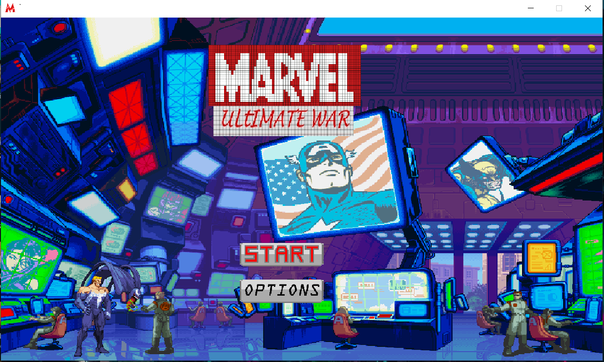
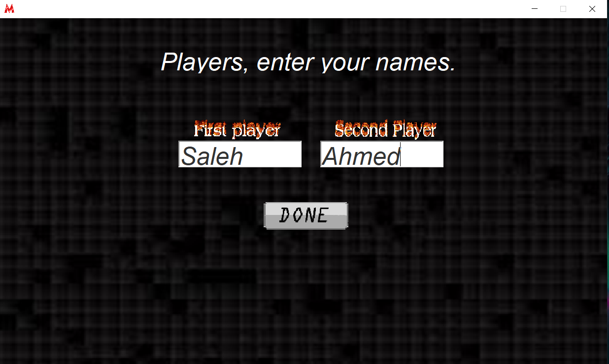
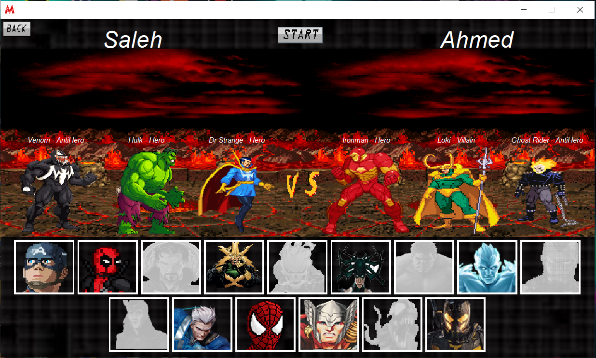
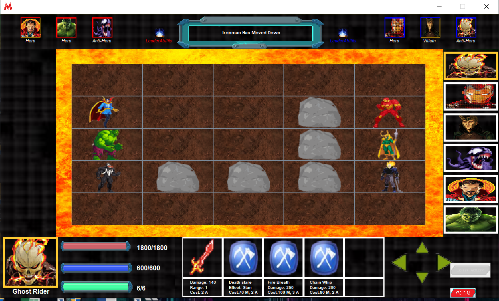

# Marvel Ultimate War

This is a Java project for a 2D game developed as part of the Object-Oriented Programming (OOP) course at the German University in Cairo.
Here is a link for the Gameplay -> https://www.youtube.com/watch?v=ymkHaNR0mck
## Description

Marvel Ultimate War is a game created using JavaFX for the graphical user interface (GUI). It is a 2D game where players can engage in battles with Marvel superheroes and villains. The game is played on a grid where each cell represents a tile. Each player has a team of characters that they can move around the grid and attack the opponent's team. The game ends when one of the teams is defeated.

## Pictures

## Features

- Interactive gameplay with intuitive controls
- Variety of Marvel characters to choose from

## License

This project is licensed under the [MIT License](LICENSE.txt).
